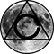

<!-- HEADING -->

<!-- 

  

<h1 align="center">️infinitygauntlet</h1> -->

<!-- DESCRIPTION -->

<h3 align="center">
  ✨
</h3>

  <strong>Personal weapon that contains my workflow.</strong> 
  Books, coding jit jots, information sessions, music playlists, & more.

<!-- INFORMATION (Shields:IO) -->

    
    

<!-- FEATURES -->

  

[_infinitygauntlet_](https://github.com/acfromspace/infinitygauntlet) is a repository with the following features:

- **Memes.** Usually wholesome, hidden away in secret aways.
- **Diversity.** I give everything a chance and share my learnings with everyone.
- **Aesthetic.** I just like the way the things look and this is heavily influence by retro, vaporwave, and lo-fi.

## 🎵 Music I zone to!

  

- [I made a website with those playlists, curated from Soundcloud, Spotify, and YouTube.](https://mindstone.netlify.com/)

## 🤔 What's inside?

【 Ｃｏｎｓｔａｎｔ　ｕｐｄａｔｅｄ　ｒｅｆｉｎｅｄ　ｃｈａｏｓ！】 (ピザが大好き)

## 🚔 [License](https://github.com/acfromspace/infinitygauntlet/blob/master/LICENSE)

The code in this project is under a specific open source license.
