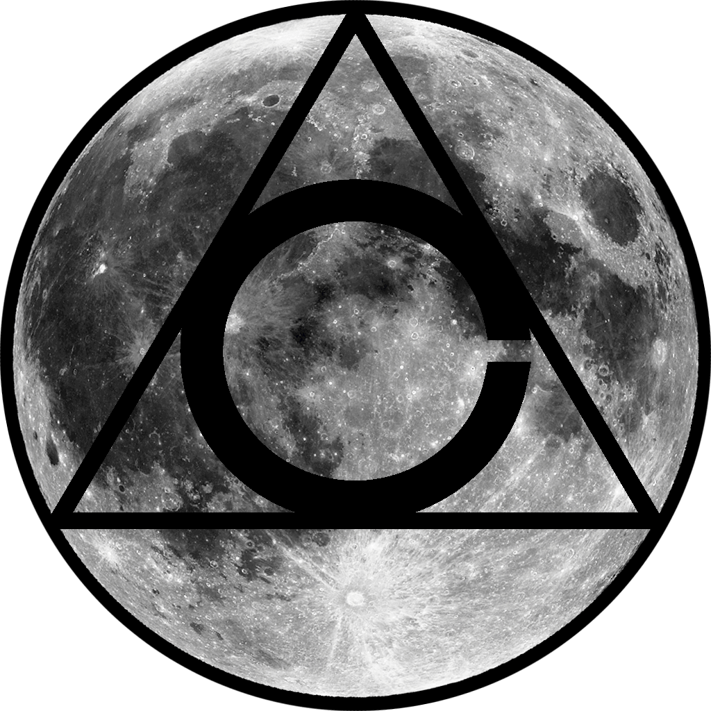

<!-- HEADING -->

  

<h1 align="center">️
  infinitygauntlet
</h1>

<!-- DESCRIPTION -->

<h3 align="center">
  ✨
</h3>

  <strong>Personal weapon that contains my workflow.</strong> 
  What I use including music playlists, plugins, software, and hardware.

<!-- INFORMATION (Shields:IO) -->

    
    

<!-- FEATURES -->

  

## 🎵 Music I zone to (Thanks Spotify)

  

* [Video Game Vibes](https://open.spotify.com/user/1252712964/playlist/5Awrm6Qg5ixDMxW7vQCn9o?si=L3srrHAeQuy3xfpXEOazzg)
* [Tender Vibes](https://open.spotify.com/user/1252712964/playlist/0XVxReRFFUe7Z5DFYPdOSU?si=wT4rC7BcRmq-SX41WupN8Q)
* [Feel Better](https://open.spotify.com/user/1252712964/playlist/0XVxReRFFUe7Z5DFYPdOSU?si=XlZu73QTShWlDcKZfiA9AQ)

<!-- QUICK INSTALLATION -->

## ✨ Other

Coming soon!

<!-- ## ✨ Quick Installation -->

<!-- IN-DEPTH INSTALLATION -->

<!-- ## 🚀 Putting this in the Infinity Gauntlet (In-Depth Installation) -->

<!-- WHAT'S INSIDE? -->

<!-- ## 🤔 What's inside?

A quick look at the top-level files and directories you'll see in this project.

    .
    ├── .gitignore
    ├── .vscode
    │   ├── launch.json
    │   ├── settings.json
    │   └── tasks.json
    └── some-file.js -->

<!-- LICENSE -->
<!-- 
## [License](LICENSE)

The code in this project is licensed under MIT license. -->
